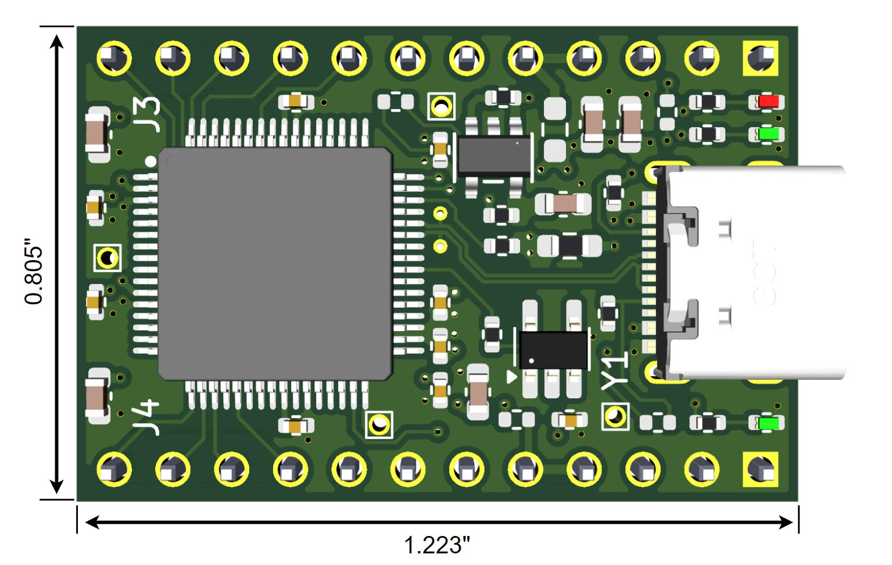
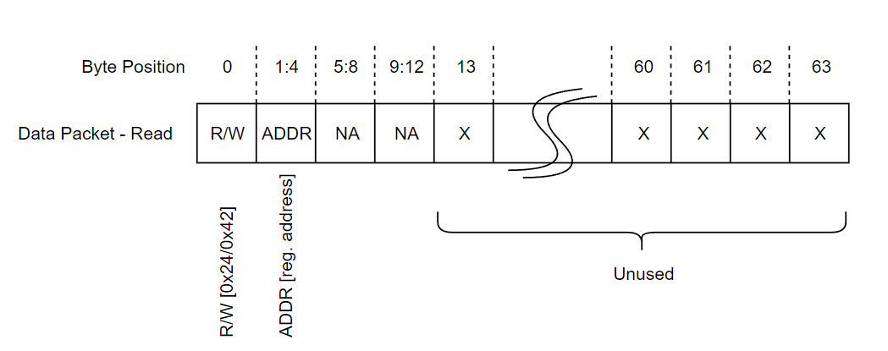
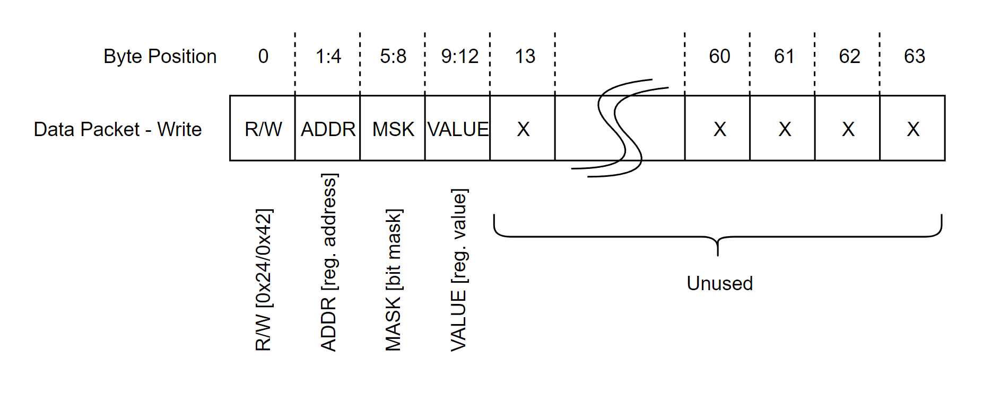
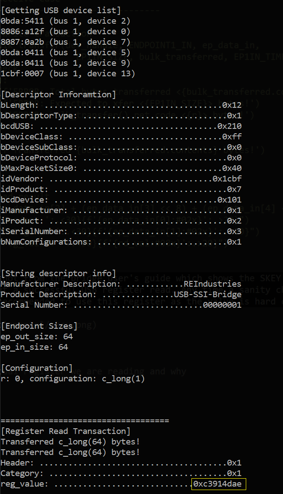

# 1. Overview
This tutorial introduces the USB to SSI/SPI bridge which translates native USB traffic to synchronous serial communications. In this tutorial we will cover the system architecture and purpose of the bridge module as well as two basic connect and power-up excersise.

The first part of this tutorial covers communications using a REIndustries provided Python library which simplifies the software user space driver access. This library is a simple wrapper for the libusb1.0 Python library. This approach is the simplest and fastest way to get up and running.

The second part of the tutorial shows how to use the Python libusb1.0 third party library directly. This approach is more complicated, but likely more desireable for custom software applications that interface to the USB2F-SSI-0-1A module.

Bridge Top View             | Bridge Side View
:-------------------------:|:-------------------------:
 |  

**Critical Notes:**
-	User must clone REIndustries USB_SSI_Libs example library inside tutorial folder for tutorials to work!

## 1.1 Bridge Overview
The USB bridge used in this tutorial is the USB2F-SSI-0-1A which, in general, is a small module that converts native USB traffic into SPI / synchronous serial traffic for an embedded system.  This part number supports 0.1" pitch through hole headers on both sides of the SOM and can fit in a standard prototyping breadboard. Many other configurations are available so visit [RisingEdgeIndustries](https://www.risingedgeindustries.com) online for more information or to ask about a custom solution. 

The USB link is USB2.0 full speed composite device with 3x interfaces.  One interface is for internal bridge register access supporting operational and configuration changes. The other two interfaces are for high and low throughput data paths.  Each data path works with native USB 2.0 64 byte packets of data. The lower datarate interface is an interrupt interface capable of 64kB/s. This interface is polled by the USB host (workstation) every 1mS supporting deterministic latency. The second data interface is a BULK interface which can operate in excess of 650kB/s (5.2Mbit/s). This datarate is dependant on how much bandwidth is available on the USB bus per USB 2.0 BULK interface protocol. A BULK interface utilizes as much free bandwidth in each USB frame as possible to transfer data.

<u>Interface Summary</u>:
-	Interface 0: Bridge register access
-	Interface 1: INTERRUPT low throughput interface
-	Interface 2: BULK high throughput interface

The embedded systems side of this bridge consists of two unidirectional SSI/SPI ports. The TX and RX data is separate to allow the customer embedded system to operate based on data frame interrupts rather than polling the bridge checking for data constantly. The polling approach eats up valuable customer embedded system bandwidth / CPU cycles.

The master SSI/SPI port forwards all USB 64 byte packets out to the target embedded system as a 68 byte frame. The frame is larger than the USB packet because 4 additional bytes of meta data are added. The meta data allows target embedded systems to know which USB interface (INT1 or BULK2) the 64 byte packet came from. This allows the embedded systems engineer to be aware of which USB interface software sent the packet over. When the embedded system assembles a frame to transmist to the USB bridge RX interface, the firmware engineer must add this meta data to the frame so the bridge knows which USB interface to forward the 64 byte payload of the 68 byte frame to.

The meta data allows the software engineer and firmware engineer on either side of the bridge to stay in sync and know which interfaces data comes from and should be sent to. This can be very valuable when users need to logically separate different types of traffic. 

An example use case may be that an embedded system needs to send low data rate telemetry information back to software which can be done over INT1 (interrupt interface 1). The software engineer can launch a thread that constantly monitors for data on the USB interface and when available, reads the data and passes it to the main software application. The BULK2 (bulk 2) interface is used specifically for large data transfers to and from the target embedded system.

The bridge module is ideal for users that need a more intelligent solution than a virtual serial port for software application to embedded system communication but also need to retain the ease and siimplicity of a simple serial link.

Some of the key features/improvements are shown below:
-	3x different USB interfaces: Internal bridge register access, 64kB/s deterministic latency data interface, 650+kB/s high throughput interface.
-	Free to use any USB user space driver or develop a custom one
-	Auto enumerates with WINUSB Windows kernel driver
-	Separate TX and RX embedded synchronous serial data interfaces for interrupt driven firmware development
-	Plug and play solution utilizing REIndustries free Python library
-	Prototype friendly, footprint compatible with standard breadboards
-	Many functional configuration options via internal bridge register space

As mentioned above, 64 byte packets are transferred over each USB interface. A block diagram of this relationship is shown below:


This diagram shows all 3x USB interfaces including the internal bridge register access interface (INT0). The 64 byte data packets sent over INT0 are commands that support changing bridge register settings and this data is not forwarded out of the SSI serial ports to a target embedded system.

The INT1 and BULK2 interface packets are received by the bridge, meta data capturing which USB interface they were received on is wrapped around the 64 byte data packet yielding the 68 byte frame and that frame is sent out of the master SSI port to the target embedded system.

A diagram of the SSI frame side of the transfer is shown below:


The traffic flow through the bridge is shown below. This block diagram describes USB packets from software on the left flowing through the bridge to a target embedded system on the right.


When plugged in, the bridge tells Windows to load WINUSB.sys as the kernel space driver automatically and leaves the user space driver selection up to the user. A diagram of this is shown below:


This means the user must select a user space driver (there are multiple available 3d party drivers) to actually talk to the USB bridge. REIndustries has selected libusb1.0 (the Python implementation is just libusb) to use for these tutorials as it is cross platform and supported as a Python library. This design and architecture choice was made to provide more advanced control to software engineers that are looking for a more robust and advanced link compared to a virtual serial port, but still want to keep things reasonably simple. For users looking for a COTS solution, a Python user space drive can be used as in this example and easily wrapped as we have shown with the associated usb library example supporting this tutorial series.

For all tutorials, the Python libusb library can be installed using "pip install libusb". This must be performed as a first step in this tutorial series.


## 1.2 Mechanical
The bridge module consists of an 0.062" thick PCB with a USB-C connector for software application connectivity and unloaded headers (via holes) supporting the embedded sysnchronous serial interfaces. Customers can load either male or female headers depending on the required interface to their PCB hardware system.

The dimensions shown below are 1.223 inches long by 0.805 inches high. These are PCB edge to edge dimensions.



# 2. Part 1: REIndustries Simple Library
Part 1 of this tutorial covers how to connect and query basic bridge information via the USB interface. 

Every USB device has information a software application can query to learn more about the device. This information is contained in data structures called descriptors. Some of this desccriptor information can be requested by software to interrogate the USB device and ensure it is both the correct and expected device.

The USB descriptor information is read from the device as well as the entire configuration register space information. The register space is read via the configuration interface INT0 (interrupt 0). All of this access is done using an example library from REIndustries with the Python programming language. This is the 'plug-and-play' solution for users who are looking for simplest and easiest way to get up and running.

One dependancy for any application interacting with the USB bridges is the usb bridge library. This library repo should be cloned for custom development of software applications and should also be cloned with any tutorials such as this one. This repo can be found on our github.

*Note: The USB_SSI_Libs repo must be clone inside this tutorial directory to work.
*Note: It is recommended USB_SSI_Libs repo is cloned inside customer repos or project directories for development.

As far as the source code goes for this part, there isn't a lot to explain. Part 1 uses the REIndustries library to open a communication link with the bridge and request bridge specific information. The information requested is the following two items:

-	USB descriptor information
-	USB bridge internal configuration register values


Just to point out how easy it is to get up and running, below is all the source code needed:

```python

from USB_SSI_Libs.rei_usb_lib import USB20F_Device


# for logger
log_file_name = "tst_dump-regs"

# open USB lib
usb_dev0 = USB20F_Device(quiet=True, name=log_file_name)
usb_dev0.open_usb()

# read and print all configuration register info
usb_dev0.dump_regspace()

# read and print all USB descriptor info
usb_dev0.dump_descriptors()

# close brige USB library
usb_dev0.close_usb()
```


# 3. Part 2: Libusb Bridge Direct Access
When the REIndustries library is not used, a user space driver must be selected and the software engineer is responsible for integrating it in their application. For part 2, we have  used a Python library wrapping libusb1.0 for simplicity as a 3'd party user space driver. This library can be pip installed easily, but does require slightly more advanced programming skills as it uses C-types. Overall it is still quite straight forward. Since we are not using the REIndustris example library the USB_SSI_Lib does not neeed to be clone.

In this part of tutorial 1, we will perform the same process for querying the USB descriptor information, but instead of dumping all the configuration registers we will perform a manual read from a single configuration register.

Before getting started, a quick mention of the configuration register access protocol is necessary. Users can change the bridge configuration and check operational status (such as frame buffer capacity, errors etc...) using interupt interface 0 (INT0). This is a 64kB/s max USB interrupt interface which allows users to send 64 byte blocks of data to the bridge which contain commands. All commands are register access commmands which means they are reads or write to a 32 bit register. The bits in these registers control a variety of different things regarding bridge operation.

Some examples are:
-	Saving configuration register info to non-volatile memory
-	Setting timeout timers for SSI/SPI communications
-	Enabling/disabling RX/TX LEDs
-	Operational error status info and error codes
-	Different bridge operating modes (see other tutorials in series)


To perform a register read, as we will do in this tutorial, a simple protocol is followed and shown below:

The above protocl shows that the first byte of the 64 byte packet is the rd/wr flag. So when set to 0x24 a read command is being issued and when set to 0x42 a write command is being issued. In this case, a 0x24 is loaded in byte 0 and the read address is loaded next. The address is 32 bits wide with the LSB first. An example of the pertinent protocol bytes is shown belo.

```python
		ep_data_out[0] = 0x24	# r/w flag

		ep_data_out[1] = 20	# reg addres (32-bit value)
		ep_data_out[2] = 0
		ep_data_out[3] = 0
		ep_data_out[4] = 0
```
Note that ep_data_out is a 64 byte array:
```python
EP1OUT_SIZE = 64*1
ep_data_out = (ct.c_ubyte*(EP1OUT_SIZE))()
```
The write command is not used in this tutorial, but a brief explanation is shown below:


The write command is similar to the read command with the addition of a bit mask and data field. The bit mask allows register write commands to control which bits are modified. This allows the user to leave bits that are not being change at their existing value. There is no need for the user to perform read-modify-write operations.

The first byte is a rd/wr flag and for read commands this will be 0x42. The second field will be a 32-bit register address. The bit mask and data values fields are self explanatory and are also 32 bits wide. The rest of the data in the USB packet is 'don't care' information.


The main take-away here is that any USB data packet sent over INT0 interface is a read or write register access command that should adhere to the read and write protocol shown above. In tutorial 1 p1 these register access commands are used to retrieve configuration register data, but the nuts and bolts shown here are obfuscated from the user with the REIndustries library example API call.


At this point, we have a basic understanding of the software system so let's dive into part 2 of the tutorial. As mentioned earlier, the Python libusb library (user space driver we are using to access the bridge USB interface) uses ctypes so we must setup our USB data structures and pointers.

```python
#
# operational definitions
#
DEF_VID = 0x1cbf
DEF_PID = 0x0007
DEF_SN = "00000001"
ENDPOINT1_OUT = 0x01
ENDPOINT1_IN = 0x81 	# usb.LIBUSB_ENDPOINT_IN + 1 # 0x81
EP1IN_SIZE = 64*1
EP1IN_TIMEOUT = 1000 	# mS
EP1OUT_SIZE = 64*1
EP1OUT_TIMEOUT = 250 	# mS
DEV_MODE = True


#
# Libusb variables/data structures
#
dev = None
dev_found = False
#sn_tstring = ""	
sn_string = (ct.c_ubyte* 18)()	# sn string
pd_string = (ct.c_ubyte* 30)()	# product string
mf_string = (ct.c_ubyte* 26)()	# manf string
device_configuration = ct.POINTER(ct.c_int)()
dev_handle = ct.POINTER(usb.device_handle)() # creates device handle (not device obj)
devs = ct.POINTER(ct.POINTER(usb.device))() # creates device structure
ep_data_out = (ct.c_ubyte*(EP1OUT_SIZE))()
ep_data_in = (ct.c_ubyte*(EP1IN_SIZE))()
bulk_transferred = ct.POINTER(ct.c_int)()	

#
# inits
#
device_configuration.contents = ct.c_int(0)
bulk_transferred.contents = ct.c_int(0)
```
The buffers for data (in and out of USB brige interfaces) is always 64 bytes per transaction so each endpoit buffer/array is 64 bytes long. Timeouts and USB endpoint IDs are also setup. Since the USB interface is a composite device there are three interfaces each with a pair of endpoints (buffers) for transferring the 64 byte blocks of data. In this example we use INT0 which has IN and OUT endpoint addresses 0x81 and 0x01 respectively. There are also a few arrays for the string descriptors and other pieces of information we want to support.

The main function in this module is the run() function which is where all the USB magic actually happens. The first step is to search for the USB bridge via VID/PID descriptor information.

```python
def run():
	# open usb library
	r = usb.init(None)
	if r < 0:
		print(f'usb init failure: {r}')
		return -1

	# get list of USB devices
	cnt = usb.get_device_list(None, ct.byref(devs))
	# error check
	if cnt < 0:
		print(f'get device list failure: {cnt}')
		return -1

	print("\n[Getting USB device list]")
	# Check all USB devices for VID/PID match
	i = 0
	while devs[i]:
		dev = devs[i]

		# get device descriptor information
		desc = usb.device_descriptor()
		r = usb.get_device_descriptor(dev, ct.byref(desc))
		# error check
		if r < 0:
			print(f'failed to get device descriptor: {r}')
			return -1

		# print usb device info for each device
		print("{:04x}:{:04x} (bus {:d}, device {:d})\n".format(
			  desc.idVendor, desc.idProduct, 
			  usb.get_bus_number(dev), usb.get_device_address(dev)), end="")


		if(desc.idVendor == DEF_VID) and (desc.idProduct == DEF_PID):
			# print all member info for descriptor structure for target device
			print('\n[Descriptor Inforamtion]')
			print(f"{'bLength: ':.<30}{f'{desc.bLength:#02x}':.>20}")
			print(f"{'bDescriptorType: ':.<30}{f'{desc.bDescriptorType:#02x}':.>20}")
			print(f"{'bcdUSB: ':.<30}{f'{desc.bcdUSB:#04x}':.>20}")
			print(f"{'bDeviceClass: ':.<30}{f'{desc.bDeviceClass:#02x}':.>20}")
			print(f"{'bDeviceSubClass: ':.<30}{f'{desc.bDeviceSubClass:#02x}':.>20}")
			print(f"{'bDeviceProtocol: ':.<30}{f'{desc.bDeviceProtocol:#02x}':.>20}")
			print(f"{'bMaxPacketSize0: ':.<30}{f'{desc.bMaxPacketSize0:#02x}':.>20}")
			print(f"{'idVendor: ':.<30}{f'{desc.idVendor:#02x}':.>20}")
			print(f"{'idProduct: ':.<30}{f'{desc.idProduct:#02x}':.>20}")
			print(f"{'bcdDevice: ':.<30}{f'{desc.bcdDevice:#02x}':.>20}")
			print(f"{'iManufacturer: ':.<30}{f'{desc.iManufacturer:#02x}':.>20}")
			print(f"{'iProduct: ':.<30}{f'{desc.iProduct:#02x}':.>20}")
			print(f"{'iSerialNumber: ':.<30}{f'{desc.iSerialNumber:#02x}':.>20}")
			print(f"{'bNumConfigurations: ':.<30}{f'{desc.bNumConfigurations:#02x}':.>20}")
			dev_found = True		
			break

		i += 1
```

The above code creates a libusb object and with this object, searches through all USB devices for our particular VID/PID. Once found, the descriptor information for the USB bridge is printed to console for the user.


Next, we get the string descriptor information which describes this particular bridge plugged into the work station in more detail. We also 'open' the USB device which gives us a 'device' handle allowing us to send data to and from the USB bridge over the INT0 interface.

```python
	#
	# open device if matching vid/pid was found
	#
	if(dev_found == True):

		r = usb.open(dev, dev_handle)
		# error check
		if r < 0:
			print(f"ret val: {r} - {usb.strerror(r)}")
			print("failed to open device!")
			return -1

		#
		# Get device string information
		#
		r = usb.get_string_descriptor(dev_handle, desc.iSerialNumber, 0x409, sn_string, 18)
		r = usb.get_string_descriptor(dev_handle, desc.iProduct, 0x409, pd_string, 30)
		r = usb.get_string_descriptor(dev_handle, desc.iManufacturer, 0x409, mf_string, 26)
		
		#
		# Print bridge string information
		#
		# utf-16 decoding
		# skip first two bytes b/c they are USB protocol specific not SN
		#
		print('\n')
		sn_string_d = bytes(sn_string)[2:].decode("utf-16") # type - string
		pd_string_d = bytes(pd_string)[2:].decode("utf-16") # type - string
		mf_string_d = bytes(mf_string)[2:].decode("utf-16") # type - string

		print("[String descriptor info]")
		print(f"{'Manufacturer Description: ':.<30}{mf_string_d:.>20}")		
		print(f"{'Product Description: ':.<30}{pd_string_d:.>20}")
		print(f"{'Serial Number: ':.<30}{sn_string_d:.>20}")
		


		#
		# get additional device endpoint/configuration information
		#
		print("\n[Endpoint Sizes]")
		ep_size = usb.get_max_packet_size(dev, 0x01)
		print(f"ep_out_size: {ep_size}")
		ep_size = usb.get_max_packet_size(dev, 0x81)
		print(f"ep_in_size: {ep_size}")
		print("\n[Configuration]")
		r = usb.get_configuration(dev_handle, device_configuration)
		print(f"r: {r}, configuration: {device_configuration.contents}")
```

At this point we now have an open USB interface and device handle that allows us to send data to the USB bridge. In this example, we will be sending read commands as described in the configuration register read command protocol earlier.

```python
		# -------------------------------------------------------------------
		print('\n\n\n===================================')
		print('[Register Read Transaction]')

		# claim interface 0 - register access
		r = usb.claim_interface(dev_handle, 0)
		# error check
		if(r != 0):
			print(f'ERROR: failed to claim interface, ret val = {r}')
			print(f"ERROR: code - {usb.strerror(r)}")


		# --------------------------------------
		# Handle Transmit Case
		# --------------------------------------
		ep_data_out[0] = 0x24	# r/w flag

		ep_data_out[1] = 20	# reg addres (32-bit value)
		ep_data_out[2] = 0
		ep_data_out[3] = 0
		ep_data_out[4] = 0

		# execute read transaction
		r = usb.bulk_transfer(dev_handle, ENDPOINT1_OUT, ep_data_out, 
								EP1OUT_SIZE, bulk_transferred, EP1OUT_TIMEOUT)	
		print(f'Transferred {bulk_transferred.contents} bytes!')


		# --------------------------------------
		# Handle Receive Case
		# --------------------------------------

		# execute write transaction
		r = usb.bulk_transfer(dev_handle, ENDPOINT1_IN, ep_data_in, 
								EP1IN_SIZE, bulk_transferred, EP1IN_TIMEOUT)	
		# error check
		if (r < 0):
			print(f'ERROR: Total bytes transferred <{bulk_transferred.contents}> bytes!')
			print(f'ERROR: Expected to xfer <{EP1IN_SIZE}> bytes!')
			print(f'ERROR: bulk_transfer() ret code <{r}> bytes!')
			return -1
		else:	
			print(f'Transferred {bulk_transferred.contents} bytes!')


		# print read result
		rd_val = ep_data_in[2] + (ep_data_in[3] << 8) + (ep_data_in[4] << 16) + (ep_data_in[5] << 24)
		print(f"{'Header: ':.<30}{f'{ep_data_in[0]:#02x}':.>20}")
		print(f"{'Category: ':.<30}{f'{ep_data_in[1]:#02x}':.>20}")
		print(f"{'reg_value: ':.<30}{f'{rd_val:#08x}':.>20}")
```

Below is a screenshot from the bridge user's guide which shows the SKEY register being read. This register is selected because it has a known value we can quickly verify to prove out a successful USB register read. Any time a sanity check is needed to verify the USB link is working correctly and the bridge USB interface is functional it is recommended to use this register as the value is hard coded and always known.

As can be seen below in the yellow box, the bridge returned its static key value to our software application which matches value defined by the user's guide. 



<a href="link" style="text-align: center">


--> figure out how to set size of image smaller


This concludes our tutorial 1 (parts 1 and 2). In other tutorials we will explore more advanced features and performance of the usb bridge.


