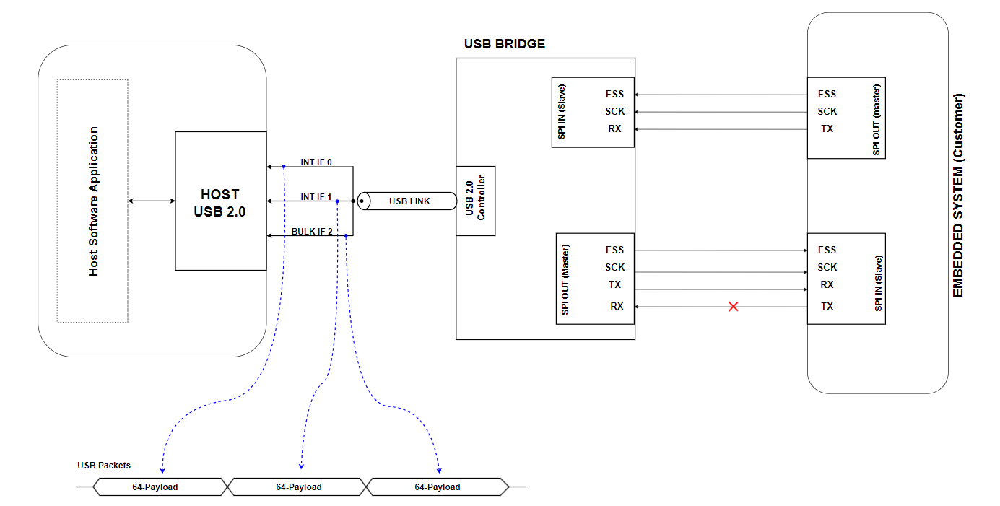
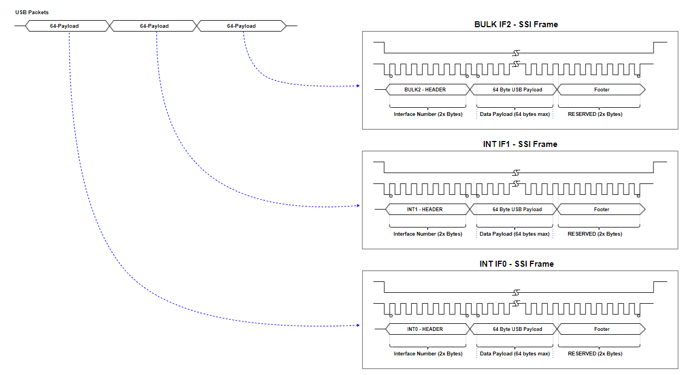
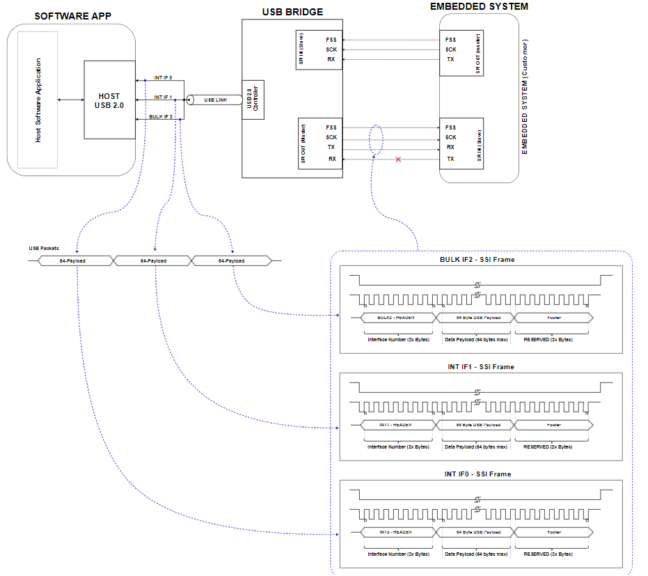
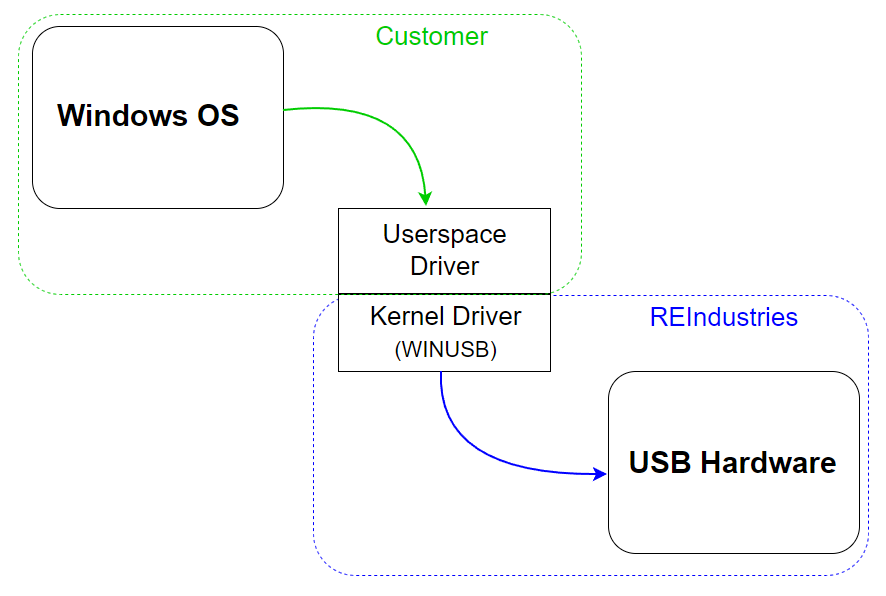

# 1. Overview
This tutorial introduces the USB to SSI/SPI bridge which translates native USB traffic to synchronous serial communications. In this tutorial we will cover the system architecture and purpose of the bridge module as well as two basic connect and power-up excersise.

The first part of this tutorial covers communications using a REIndustries provided Python library which simplifies the software user space driver access. This library is a simple wrapper for the libusb1.0 Python library. This approach is the simplest and fastest way to get up and running.

The second part of the tutorial shows how to use the Python libusb1.0 third party library directly. This approach is more complicated, but likely more desireable for custom software applications that interface to the USB2F-SSI-0-1A module.

Bridge Top View             | Bridge Side View
:-------------------------:|:-------------------------:
 |  

## 1.1 Bridge Overview
The USB bridge used in this tutorial is the USB2F-SSI-0-1A which, in general, is a small module that converts native USB traffic into SPI / synchronous serial traffic for an embedded system.  This part number supports 0.1" pitch through hole headers on both sides of the SOM and can fit in a standard prototyping breadboard. Many other configurations are available so visit [RisingEdgeIndustries](https://www.risingedgeindustries.com) online for more information or to ask about a custom solution. 

The USB link is USB2.0 full speed composite device with 3x interfaces.  One interface is for internal bridge register access supporting operational and configuration changes. The other two interfaces are for high and low throughput data paths.  Each data path works with native USB 2.0 64 byte packets of data. The lower datarate interface is an interrupt interface capable of 64kB/s. This interface is polled by the USB host (workstation) every 1mS supporting deterministic latency. The second data interface is a BULK interface which can operate in excess of 650kB/s (5.2Mbit/s). This datarate is dependant on how much bandwidth is available on the USB bus per USB 2.0 BULK interface protocol. A BULK interface utilizes as much free bandwidth in each USB frame as possible to transfer data.

The embedded systems side of this bridge consists of two unidirectional SSI/SPI ports. The TX and RX data is separate to allow the customer embedded system to operate based on data frame interrupts rather than polling the bridge checking for data constantly. The polling approach eats up valuable customer embedded system bandwidth / CPU cycles.

The master SSI/SPI port forwards all USB 64 byte packets out to the target embedded system as a 68 byte frame. The frame is larger than the USB packet because 4 additional bytes of meta data are added. The meta data allows target embedded systems to know which USB interface (INT1 or BULK2) the 64 byte packet came from. This allows the embedded systems engineer to be aware of which USB interface software sent the packet over. When the embedded system assembles a frame to transmist to the USB bridge RX interface, the firmware engineer must add this meta data to the frame so the bridge knows which USB interface to forward the 64 byte payload of the 68 byte frame to.

The meta data allows the software engineer and firmware engineer on either side of the bridge to stay in sync and know which interfaces data comes from and should be sent to. This can be very valuable when users need to logically separate different types of traffic. 

An example use case may be that an embedded system needs to send low data rate telemetry information back to software which can be done over INT1 (interrupt interface 1). The software engineer can launch a thread that constantly monitors for data on the USB interface and when available, reads the data and passes it to the main software application. The BULK2 (bulk 2) interface is used specifically for large data transfers to and from the target embedded system.

The bridge module is ideal for users that need a more intelligent solution than a virtual serial port for software application to embedded system communication but also need to retain the ease and siimplicity of a simple serial link.

Some of the key features/improvements are shown below:
-	3x different USB interfaces: Internal bridge register access, 64kB/s deterministic latency data interface, 650+kB/s high throughput interface.
-	Free to use any USB user space driver or develop a custom one
-	Auto enumerates with WINUSB Windows kernel driver
-	Separate TX and RX embedded synchronous serial data interfaces for interrupt driven firmware development
-	Plug and play solution utilizing REIndustries free Python library
-	Prototype friendly, footprint compatible with standard breadboards
-	Many functional configuration options via internal bridge register space

As mentioned above, 64 byte packets are transferred over each USB interface. A block diagram of this relationship is shown below:


This diagram shows all 3x USB interfaces including the internal bridge register access interface (INT0). The 64 byte data packets sent over INT0 are commands that support changing bridge register settings and this data is not forwarded out of the SSI serial ports to a target embedded system.

The INT1 and BULK2 interface packets are received by the bridge, meta data capturing which USB interface they were received on is wrapped around the 64 byte data packet yielding the 68 byte frame and that frame is sent out of the master SSI port to the target embedded system.

A diagram of the SSI frame side of the transfer is shown below:


The traffic flow through the bridge is shown below. This block diagram describes USB packets from software on the left flowing through the bridge to a target embedded system on the right.


When plugged in, the bridge tells Windows to load WINUSB.sys as the kernel space driver automatically and leaves the user space driver selection up to the user. A diagram of this is shown below:


This means the user must select a user space driver (there are multiple available 3d party drivers) to actually talk to the USB bridge. REIndustries has selected libusb1.0 to use for these tutorials as it is cross platform and supported as a Python library. This design and architecture choice was made to provide more advanced control to software engineers that are looking for a more robust and advanced link than a virtual serial port, but still want to keep things reasonably simple. For users looking for a COTS solution, a Python user space drive can be used as in this example and easily wrapped as we have shown with the associated usb library example supporting this tutorial series.


# 2. Part 1: REIndustries Simple Library
Part 1 of this tutorial covers how to connect and query basic bridge information via the USB interface. 

Every USB device has information a software application can query to learn more about the device. This information is contained in data structures called descriptors. Some of this desccriptor information can be requested by software to interrogate the USB device and ensure it is both the correct and expected device.

The USB descriptor information is read from the device as well as the entire configuration register space information. The register space is read via the configuration interface INT0 (interrupt 0). All of this access is done using an example library from REIndustries with the Python programming language. This is the 'plug-and-play' solution for users who are looking for simplest and easiest way to get up and running.

One dependancy for any application interacting with the USB bridges is the usb bridge library. This library repo should be cloned for custom development of software applications and should also be cloned with any tutorials such as this one. This repo can be found on our github.


As far as the source code goes for this part, there isn't a lot to explain. Part 1 uses the REIndustries library to open a communication link with the bridge and request bridge specific information. The information requested is the following two items:

-	USB descriptor information
-	USB bridge internal configuration register values


Just to point out how easy it is to get up and running, below is all the source code needed:

```python

from USB_SSI_Libs.rei_usb_lib import USB20F_Device


# for logger
log_file_name = "tst_dump-regs"

# open USB lib
usb_dev0 = USB20F_Device(quiet=True, name=log_file_name)
usb_dev0.open_usb()

# read and print all configuration register info
usb_dev0.dump_regspace()

# read and print all USB descriptor info
usb_dev0.dump_descriptors()

# close brige USB library
usb_dev0.close_usb()
```


# 3. Part 2: Libusb1.0 Bridge Direct Access
--> This part 2 performs a single register access so just use that as example and explain the rd/wr protocol.

When the REIndustries library is not used, a user space driver must be selected and the software engineer is responsible for integrating it in their application. For part 2, we have  used a Python version of libusb1.0 for simplicity. This requires some C-types coding, but is still pretty straight forward.

In part 2 we are performing the same operations of reading the USB bridge descriptor information as well as the internal USB bridge register space information and reporting it to the user. The only difference is that we will be directly accessing the user space driver.

--> step the the basic blocks of the application and discuss briefly what each code block does.


